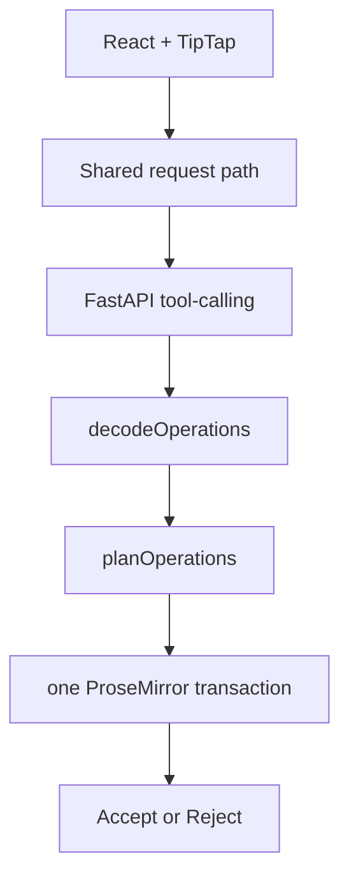

# DocxEditor

A Word-like desktop document editor. AI edits are structured operations on a TipTap/ProseMirror document, not a live HTML dump.

Stack: React 19, TipTap 3, FastAPI, python-docx, Tauri 2.

This is an early, actively developed project. It is not Microsoft Word, not lossless DOCX, and not a zero-dependency installer.

[English](README.md) · [简体中文](README.zh-CN.md)

[](https://github.com/rainhuang0220/docxeditor/actions/workflows/ci.yml)

## Status

Current `main` includes AI editing hardening that is **not** in the v0.1.0 DMG:

- chat streams over SSE; the document is not written until a terminal result
- request-time document, selection, cursor, revision, and thread identity
- one shared request path (selection menu does not run its own apply)
- runtime decode + complete preflight + one atomic ProseMirror transaction
- confirmable edits then Accept / Reject, with a mutation firewall while pending
- invalid, stale, aborted, or truncated results leave the document unchanged

Desktop packaging still expects a local Python backend. Browser `npm run dev` is the supported developer path.

## Features

### Available now

**Editor.** Headings H1–H3, bold/italic/underline/strike/highlight/sub/superscript, lists, tables, block images, links, code blocks, blockquotes, page breaks, fonts/size/color/alignment, find/replace (including regex), outline, IndexedDB document + version snapshots, templates, dark mode, A4-style page chrome.

**AI.** OpenAI and Anthropic native tool-calling. Chat streams in the panel. Selection and cursor are captured when you send. Model output is decoded, planned against the original document, and applied as one transaction. Destructive edits (`replace_content`, `replace_paragraph`, `delete_paragraph`) require Accept or Reject. API keys are stored by the backend: the OS keyring when it is available, otherwise in process memory for that backend session only. `OPENAI_API_KEY` and `ANTHROPIC_API_KEY` remain backend-only fallbacks.

**DOCX.** Best-effort import/export of headings, lists, tables, images, hyperlinks, and page breaks.

### Limitations

- Not a Word replacement. Headers/footers in the UI are placeholders, not OOXML sections.
- DOCX round-trip is lossy (comments, native headers/footers, stylesheets, H4+ collapsed).
- The v0.1.0 macOS arm64 DMG does not bundle a Python runtime. AI in that build needs a local FastAPI process (or this checkout at a well-known path). Unsigned; Gatekeeper may block first launch.
- If the OS keyring is unavailable, a key typed in the app lasts only for the current backend process and is not written to disk
- A local process that can call the backend is not authenticated yet
- No Windows/Linux prebuilt. No collaboration. No local-model providers yet.

## Architecture

```text
React / TipTap editor
        ↓
shared AI request controller
        ↓
FastAPI (OpenAI / Anthropic tool-calling, DOCX)
        ↓
runtime operation decoder
        ↓
preflight planner (original document numbering)
        ↓
atomic ProseMirror transaction
        ↓
Accept / Reject when confirmation is required
```

Tauri owns a bundled Python sidecar. The desktop app does not use a system Python or anything already listening on port 8000. Browser development is a separate, explicit insecure mode.



## AI edit safety

| Step | Behavior |
|---|---|
| Request identity | Document node, HTML, revision, selection/cursor, thread, and model are captured before any await. |
| Staleness | If the document, revision, request, or thread no longer matches, the result is not applied. |
| Validation | Unknown types, bad fields, over-limit batches, and out-of-range block indexes reject the **entire** batch. |
| Atomic apply | Surviving operations commit as one transaction, or none do. |
| Review | Confirmable edits lock the document until Accept or Reject. Reject restores the pre-edit snapshot and does not leave the proposal on the undo stack. |
| Failure | Abort, error, incomplete stream, and invalid ops fail closed. Chat may still stream; the document does not. |

These are engineering controls, not a security guarantee.

## Quick start

### Prerequisites

- Node.js **22.12+** (`npm test` uses Node's type stripping; Vite 8 also rejects older 20.x)
- Python **3.11+**
- Rust **1.77.2+** and Xcode Command Line Tools only if you build the desktop app

### Install (repo root)

```bash
npm install
cd frontend && npm install && cd ..

cd backend
python3 -m venv .venv
source .venv/bin/activate
python3 -m pip install -r requirements.txt
cd ..

cp .env.example .env   # optional; you can also set the key in the app
```

### Run (browser)

```bash
npm run dev
```

- Backend: http://127.0.0.1:8000
- Frontend: http://localhost:5173 (`/api` is proxied to the backend)

Separate terminals:

```bash
bash start-backend.sh
cd frontend && npm run dev
```

Without a provider key the editor still runs; the AI panel will not.

### Desktop development

`npm run tauri:dev` opens the native window but does **not** start Vite. Serve the frontend separately (`npm run dev` or `cd frontend && npm run dev`) so `http://localhost:5173` is up.

```bash
npm run tauri:build
```

Output is under `src-tauri/target/release/bundle/`. The bundle copies Python sources; it does not ship a venv.

## Testing

```bash
cd frontend && npm test && npm run build && cd ..
python3 -m backend.test_continuation
python3 -m backend.test_credentials
```

The suite covers request identity, review/history isolation, runtime operation validation, target preflight, atomic application, document durability, and provider continuation (no live API keys).

## Repository layout

```text
frontend/     React + TipTap UI; AI runtime in frontend/src/ai/
backend/      FastAPI, tool-calling, DOCX import/export
src-tauri/    Tauri 2 window and packager
```

Planning notes (not current implementation): [`AI-Native Word IDE Development Specification.md`](./AI-Native%20Word%20IDE%20Development%20Specification.md).  
Current AI invariants: [`GPT-HANDOFF.md`](./GPT-HANDOFF.md).

## Releases

A macOS Apple Silicon preview is on [GitHub Releases](https://github.com/rainhuang0220/docxeditor/releases) as **v0.1.0**. That build predates the AI safety work on `main`. Prefer `npm run dev` for current behavior.

## License

Licensed under the [Apache License 2.0](LICENSE) (`Apache-2.0`).
